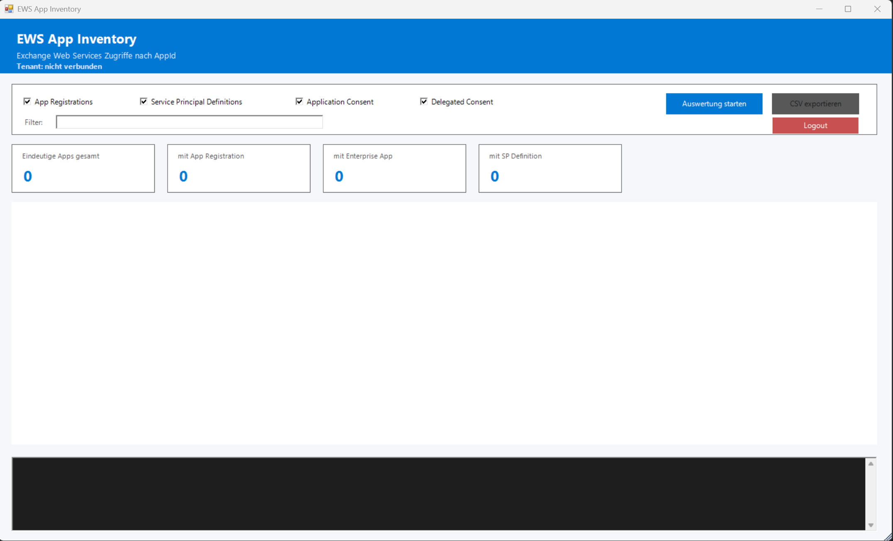
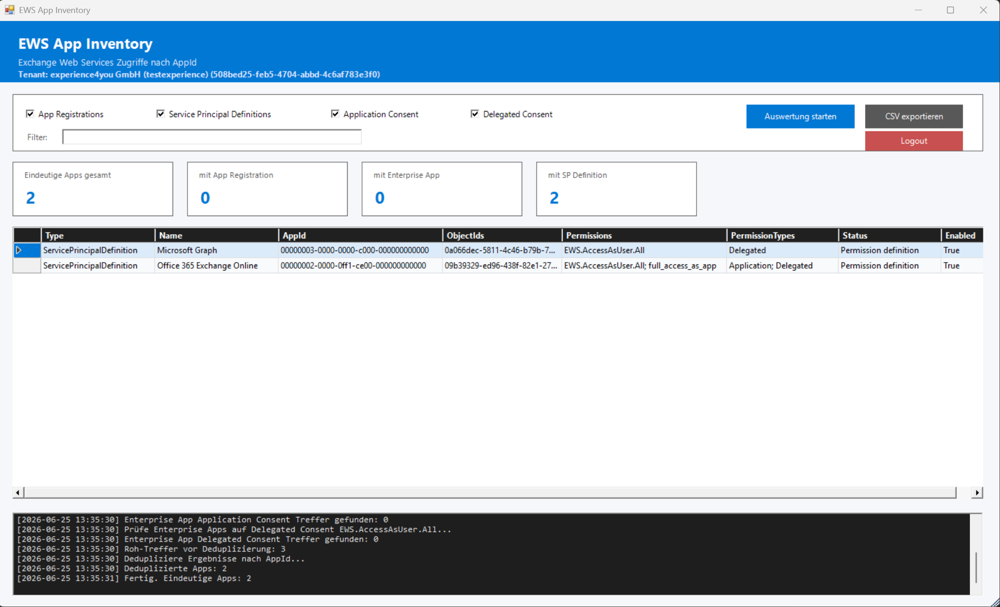
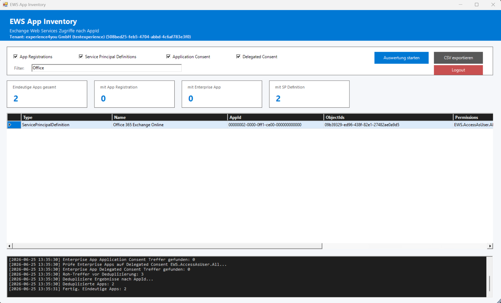
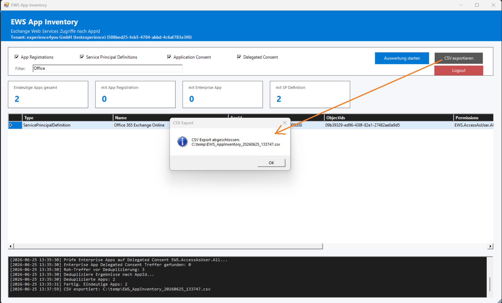
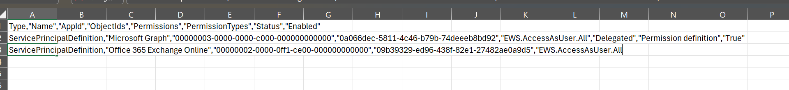
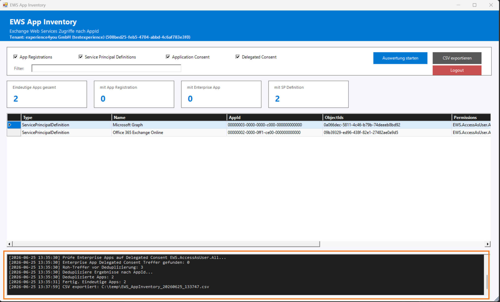

# EWS App Inventory GUI

[](https://opensource.org/licenses/MIT)
[](https://github.com/PowerShell/PowerShell)
[](https://learn.microsoft.com/powershell/)
[](#)

## 🖼️ Screenshots

### GUI Overview



### Filtering


### CSV Export



### Logging



**Modern PowerShell GUI for analyzing Exchange Web Services (EWS) permissions across Microsoft Entra ID applications**

***

## 🔐 General Background

### What's the Problem?

Exchange Web Services (**EWS**) is a legacy API that is still widely used by:

* Legacy applications
* Migration tools
* Custom integrations

However:

* ❌ Permissions are often **overprivileged**
* ❌ Visibility is limited across different object types
* ❌ Standard reports do not provide full correlation

***

### Why Does This Matter?

Uncontrolled EWS access can lead to:

* **Full mailbox access via apps** (`full_access_as_app`)
* **User-context mailbox access** (`EWS.AccessAsUser.All`)
* **Shadow IT integrations without visibility**

👉 This is critical for:

* Security audits
* Compliance requirements (CIS, ISO, NIST)
* Migration to Microsoft Graph

***

## ✨ Features

### 🖥️ **Modern GUI Interface**

* Windows Forms GUI (no CLI knowledge required)
* Real-time filtering
* Clean, structured data grid
* Integrated logging console
* Tenant information display

***

### 🔍 **Comprehensive EWS Discovery**

Detects across multiple sources:

* ✅ App Registrations (Configured permissions)
* ✅ Service Principal Definitions (Available permissions)
* ✅ Enterprise Applications (Granted consent)

***

### 🔐 **Permission Awareness**

Identifies:

* **Application Permissions**
  * `full_access_as_app`

* **Delegated Permissions**
  * `EWS.AccessAsUser.All`

***

### ⚙️ **Correlation & Deduplication**

* Combines all findings across sources
* Normalizes data by **AppId**
* Eliminates duplicates
* Produces **audit-ready results**

***

### 📊 **Export & Reporting**

* CSV export (UTF-8)
* Structured output
* Ready for:
  * Excel
  * SIEM ingestion
  * Audit documentation

***

### 🔑 **Session Handling**

* Automatic Microsoft Graph login
* Scope validation
* Logout button
* Automatic logout when GUI closes

***

## 🖼️ Screenshots

*(optional – hier kannst du später GUI Screenshots ergänzen)*

***

## 🚀 Quick Start

### Launch GUI

```powershell
powershell.exe -ExecutionPolicy Bypass -File .\Get-EWS-AppInventory-GUI.ps1
```

***

## 📖 Usage

### GUI Mode (Default)

Start the graphical interface:

```powershell
.\Get-EWS-AppInventory-GUI.ps1
```

***

### Workflow

1. Start the tool
2. Connect to Microsoft Graph
3. Select analysis scope:
   * App Registrations
   * Service Principal Definitions
   * Application Consent
   * Delegated Consent
4. Click **"Auswertung starten"**
5. Review results
6. Export to CSV if needed

***

## 🧠 How It Works

### 1. App Registrations

* Reads `requiredResourceAccess`
* Filters Exchange Online AppId
* Detects EWS permissions

***

### 2. Service Principal Definitions

* Evaluates:
  * AppRoles (`full_access_as_app`)
  * OAuth scopes (`EWS.AccessAsUser.All`)

***

### 3. Application Consent

* Queries Graph API:
  * `appRoleAssignedTo`
* Identifies granted **Application permissions**

***

### 4. Delegated Consent

* Queries:
  * `oauth2PermissionGrants`
* Detects **Delegated permissions**

***

### 5. Correlation Engine

* Aggregates results by AppId
* Merges:
  * Registrations
  * Enterprise Apps
  * Definitions
* Produces a unified dataset

***

## 📊 Output

| Field           | Description                                                   |
| --------------- | ------------------------------------------------------------- |
| Type            | Data source (AppRegistration / EnterpriseApp / SP Definition) |
| Name            | Application name                                              |
| AppId           | Application ID                                                |
| ObjectIds       | Related object IDs                                            |
| Permissions     | Detected EWS permissions                                      |
| PermissionTypes | Application / Delegated                                       |
| Status          | Configuration / Consent state                                 |
| Enabled         | App or Service Principal state                                |

***

## 🔐 Authentication

Uses Microsoft Graph PowerShell SDK.

### Required Permissions

* `Application.Read.All`
* `Directory.Read.All`

### Install Modules

```powershell
Install-Module Microsoft.Graph -Scope CurrentUser
```

***

## 📁 Export

Export results to CSV:

* UTF-8 encoded
* Sorted output
* Audit-ready

***

## ⚠️ Limitations

* Requires Graph API access
* Large tenants may increase runtime
* Focused only on EWS-related permissions

***

## 🧩 Use Cases

* Security audits
* EWS deprecation planning
* Tenant security assessments
* Detection of risky app permissions
* Legacy API usage analysis

***

## 📄 License

This project is licensed under the **MIT License**.

***

**Version**: 1.0.0  
**Last Updated**: June, 2026
**Maintained by**: experience4you GmbH
